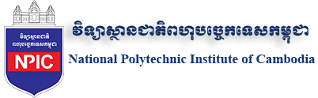

Keyman is a [free and open source](../free) multilingual keyboard system which
allows you to [build and share](../developer) keyboard layouts for any language.
Keyman already supports over 2,500 languages and more are contributed every
week.

Keyman was originally created in 1993 to type Lao on Windows. It  is available
for many platforms, including [Windows](../windows/), [macOS](../mac/),
[iOS](../iphone-and-ipad/), [Android](../android/), [Linux](../linux/) and the
[web](https://keymanweb.com).

Keyboard layouts are defined with a clear and easy to understand keyboard
grammar. Keyman's contextual input model means keyboard layouts can be
intelligent and make it simple to type even the most complex languages. Keyboard
layouts are distributed through an
[open catalog](https://help.keyman.com/developer/keyboards) to all major desktop and
mobile platforms.

## About SIL Global

Keyman is created by SIL Global (formerly SIL International). Partners in Language Development,
SIL Global is a faith-based nonprofit organization committed to serving language communities
worldwide as they build capacity for sustainable language development. SIL does this primarily
through research, translation, training and materials development.

You can learn more about SIL Global on the [SIL Global web site](https://www.sil.org/about).

## About the team

➡️ [About the Keyman team](team/)

## Thank you to supporting organizations

<table>

<!-- Microsoft -->

<tr>
  <td style='vertical-align: middle; text-align: center'></td>
  <td style='vertical-align: middle'>

  <a href='https://microsoft.com'>Microsoft</a>, through their <a href='http://aka.ms/appassure'>App Assure program</a>,
  have supported the ongoing development of Keyman through donation of computer hardware for testing.

  
</td>
</tr>

<tr><td colspan='2'>
</td></tr>

<!-- NPIC -->

<tr>
  <td style='vertical-align: middle; text-align: center'></td>
  <td style='vertical-align: middle'>

  The <a href='https://npic.edu.kh/'>National Polytechnic Institute of Cambodia
  (NPIC)</a> is Cambodia's premier center for vocational training and higher
  education and is located in Phnom Penh. The NPIC hosts the Keyman Cambodian
  team office.

  
</td>
</tr>

<tr><td colspan='2'>
</td></tr>

<!-- Cloudflare -->

<tr>
  <td style='vertical-align: middle; text-align: center'></td>
  <td style='vertical-align: middle'>

  <a href='https://www.cloudflare.com'>Cloudflare</a> speeds up and protects millions of
  websites, including ours. Their global CDN helps ensure the Keyman keyboards
  remain available world-wide. Many thanks for their free professional plan as a
  way of supporting the Keyman  open source development.

  
</td>
</tr>

<tr><td colspan='2'>
</td></tr>

<!-- Browserstack -->

<tr>
  <td style='vertical-align: middle; text-align: center'></td>
  <td style='vertical-align: middle'>

  We are using <a href='https://www.browserstack.com/'>BrowserStack</a> to test KeymanWeb
  and browser and renderer support for various languages and scripts. BrowserStack
  is an awesome tool to automatically test your website across thousands of
  different devices and browsers, instantly. They have kindly sponsored us with a
  free plan as a way of supporting the open source development of KeymanWeb! Many
  thanks, BrowserStack :)

  
</td>
</tr>

<tr><td colspan='2'>
</td></tr>

<!-- Sentry -->

<tr>
  <td style='vertical-align: middle; text-align: center'></td>
  <td style='vertical-align: middle'>

  Keyman uses <a href='https://sentry.io'>Sentry</a> for error monitoring. Thank you to
  Sentry for sponsoring the Keyman project with a free plan!

  
</td>
</tr>

<tr><td colspan='2'>
</td></tr>

<!-- 1Password -->

<tr>
  <td style='vertical-align: middle; text-align: center'></td>
  <td style='vertical-align: middle'>

  Thank you to <a href='https://1password.com'>1Password</a> for supporting the Keyman team
  with an open source plan.

  
</td>
</tr>

<tr><td colspan='2'>
</td></tr>

</table>

## Social Media and Mailing Lists

<!--?php require_once('includes/ui/contact-social.php'); ?-->

  <a href="https://www.facebook.com/KeymanApp">Facebook</a>
   
  <a href="https://twitter.com/keyman">X/Twitter</a>
   
  <a href="https://typo.social/@keyman">Mastodon (typo.social)</a>
   
  <a href="https://www.youtube.com/@KeymanApp">YouTube</a>
   
  <a href="https://community.software.sil.org/c/keyman">SIL Keyman Community Forum</a>
   
  <a href="../about/list">Keyman Announcements by Email</a>

