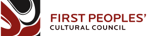

## Financial sponsors

<table class='sponsors'>

<tr>
  <td style='vertical-align: middle; text-align: center' markdown="1"></td>
  <td style='vertical-align: middle'>

  [First Peoples' Cultural Council](https://fpcc.ca) work with First Nations
  communities in B.C. to build the vitality of our cherished Languages, Arts,
  Cultures and Heritage – today and for the future.

  
</td>
</tr>

<tr>
  <td style='vertical-align: middle; text-align: center' markdown="1"></td>
  <td style='vertical-align: middle'>

  [Typotheque](https://www.typotheque.com) is a Netherlands-based type design
  company, recognised internationally as experts in multilingual typography and
  creating innovative font solutions for both global and local audiences.

  
</td>
</tr>

<tr><td></td><td>

  Please contact us if you are interested in sponsoring Keyman.

  ➡️ <a href='/contact' class='share-link'>Become a sponsor</a>

  
</td></tr>

</table>

---

## Service sponsors

We are very grateful to the following organizations who have sponsored Keyman
through donation of equipment or services, helping us to serve you and
Indigenous and minority language communities around the world.

<table>

<!-- Microsoft -->

<tr>
  <td style='vertical-align: middle; text-align: center'></td>
  <td style='vertical-align: middle'>

  <a href='https://microsoft.com'>Microsoft</a>, through their <a
  href='http://aka.ms/appassure'>App Assure program</a>, have supported the
  ongoing development of Keyman through donation of computer hardware for
  testing.

  
</td>
</tr>

<tr><td colspan='2'>
</td></tr>

<!-- NPIC -->

<tr>
  <td style='vertical-align: middle; text-align: center'></td>
  <td style='vertical-align: middle'>

  The <a href='https://npic.edu.kh/'>National Polytechnic Institute of Cambodia
  (NPIC)</a> is Cambodia's premier center for vocational training and higher
  education and is located in Phnom Penh. The NPIC hosts the Keyman Cambodian
  team office.

  
</td>
</tr>

<tr><td colspan='2'>
</td></tr>

<!-- Cloudflare -->

<tr>
  <td style='vertical-align: middle; text-align: center'></td>
  <td style='vertical-align: middle'>

  <a href='https://www.cloudflare.com'>Cloudflare</a> speeds up and protects millions of
  websites, including ours. Their global CDN helps ensure the Keyman keyboards
  remain available world-wide. Many thanks for their free professional plan as a
  way of supporting the Keyman  open source development.

  
</td>
</tr>

<tr><td colspan='2'>
</td></tr>

<!-- Browserstack -->

<tr>
  <td style='vertical-align: middle; text-align: center'></td>
  <td style='vertical-align: middle'>

  We are using <a href='https://www.browserstack.com/'>BrowserStack</a> to test KeymanWeb
  and browser and renderer support for various languages and scripts. BrowserStack
  is an awesome tool to automatically test your website across thousands of
  different devices and browsers, instantly. They have kindly sponsored us with a
  free plan as a way of supporting the open source development of KeymanWeb! Many
  thanks, BrowserStack :)

  
</td>
</tr>

<tr><td colspan='2'>
</td></tr>

<!-- Sentry -->

<tr>
  <td style='vertical-align: middle; text-align: center'></td>
  <td style='vertical-align: middle'>

  Keyman uses <a href='https://sentry.io'>Sentry</a> for error monitoring. Thank you to
  Sentry for sponsoring the Keyman project with a free plan!

  
</td>
</tr>

<tr><td colspan='2'>
</td></tr>

<!-- 1Password -->

<tr>
  <td style='vertical-align: middle; text-align: center'></td>
  <td style='vertical-align: middle'>

  Thank you to <a href='https://1password.com'>1Password</a> for supporting the Keyman team
  with an open source plan.

  
</td>
</tr>

</table>
